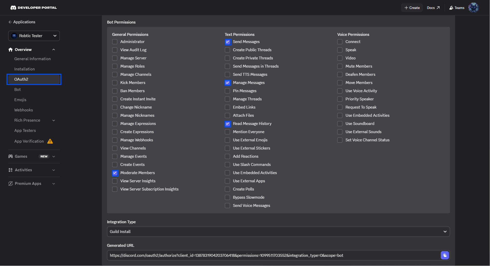
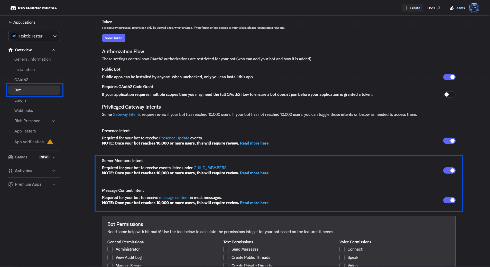

<div align="center">


**Automatic cross-channel spam & scam image detection for Discord**

<p>
  <a href="https://github.com/robticorg/scam-guard/stargazers"></a>
  <a href="https://github.com/robticorg/scam-guard/network/members"></a>
  <a href="https://github.com/robticorg/scam-guard/issues"></a>
  <a href="LICENSE"></a>
  <a href="https://discord.gg/3vfqhtgZM5"></a>
  <a href="https://bun.sh"></a>
</p>

</div>

---

ScamGuard watches your server for the same image posted across multiple channels at once — the #1 sign of a coordinated scam raid. When detected, it deletes every copy and times out the user automatically.

---

## Features

| | |
|---|---|
| **Cross-channel detection** | Catches the same file uploaded to 3+ channels within 60 seconds |
| **URL & embed detection** | Also detects image links pasted as text or shared via link preview |
| **Instant deletion** | Every spam message is removed on arrival, including ones sent after the trigger |
| **Auto timeout** | Spammer receives a 10-minute timeout the moment spam is confirmed |
| **Moderation alerts** | Posts a summary to your log channel listing the user and affected channels |
| **Zero false positives** | Only fires when the same key appears in 3+ different channels — never for single-channel posts |
| **Lightweight** | No database, no external services — runs entirely in memory |

---

## Public Bot

Don't want to host it yourself? **Invite the public version** directly to your server with one click:

> **[👉 Add ScamGuard to your server](https://discord.com/oauth2/authorize?client_id=1517521977991237772&permissions=8&integration_type=0&scope=bot+applications.commands)**

---

## Requirements

To self-host, you need:

- [Bun](https://bun.sh) v1.0+
- A Discord bot with these **permissions**:
  - `Manage Messages` — to delete spam
  - `Moderate Members` — to timeout users
  - `Read Message History`
  - `Send Messages` — for log channel alerts
- These **Privileged Gateway Intents** enabled in the Developer Portal:
  - `Server Members Intent`
  - `Message Content Intent`

---

## Getting Started

### 1. Clone the repository

```bash
git clone https://github.com/robticorg/scam-guard.git
cd scam-guard
```

### 2. Install dependencies

```bash
bun install
```

### 3. Configure environment variables

```bash
cp .env.example .env
```

Open `.env` and fill in:

| Variable | Required | Description |
|---|---|---|
| `TOKEN` | Yes | Bot token from the [Discord Developer Portal](https://discord.com/developers/applications) |
| `LOG_CHANNEL_ID` | No | Channel ID for moderation alerts. Leave empty to disable. |

> See [.env.example](.env.example) for the full variable list including test variables.

### 4. Invite the bot to your server

In the Developer Portal, generate an invite URL with:
- Scope: `bot`
- Permissions: `Manage Messages`, `Moderate Members`, `Read Message History`, `Send Messages`



Enable these under **Privileged Gateway Intents**:



### 5. Run the bot

```bash
# Production
bun run start

# Development — auto-restarts on file changes
bun run dev

# Development with full debug logging
DEBUG=1 bun run dev
```

On startup you will see:

```
[ScamGuard] online as ScamGuard#0000 (bot-id)
[ScamGuard] watching 1 guild(s)
```

---

## Video Tutorial

> **Coming soon** — a full walkthrough covering bot creation, permissions, and `.env` setup.
>
> Subscribe or join our [Discord](https://discord.gg/3vfqhtgZM5) to be notified when it's live.

---

## How It Works

1. A user posts an image (file upload, CDN URL, or link preview) in a channel.
2. ScamGuard records the image key, user, channel, and timestamp.
3. When the same key appears in **3+ different channels within 60 seconds**, spam is confirmed.
4. The triggering message is deleted instantly. All previous copies are deleted and the user is timed out.
5. Any messages posted after the threshold is crossed are also deleted on arrival.

---

## Configuration

All values are in [src/config/constant.ts](src/config/constant.ts):

| Constant | Default | Description |
|---|---|---|
| `CHANNEL_THRESHOLD` | `3` | Unique channels needed to trigger |
| `WINDOW_MS` | `60 000` ms | Rolling time window |
| `TIMEOUT_MS` | `600 000` ms | Duration of the user timeout (10 min) |

---

## Testing

The test suite runs a real "spammer" bot against a live guild where ScamGuard is active.

### 1. Add test variables to `.env`

```env
SPAMMER_TOKEN=your_spammer_bot_token
TEST_GUILD_ID=your_guild_id
TEST_CHANNEL_IDS=channel1,channel2,channel3,channel4
ALLOW_BOT_MESSAGES=1
```

### 2. Start ScamGuard in test mode

```bash
ALLOW_BOT_MESSAGES=1 bun run dev
```

### 3. Run the test suite

```bash
bun run test          # standard
bun run test:debug    # with full debug output
```

### Scenarios covered

| # | Scenario | Expected |
|---|---|---|
| 1 | Same image → 3 channels | Deleted + user timed out |
| 2 | Same image → 2 channels | No action |
| 3 | Different images → 3 channels | No action |
| 4 | Text only → 3 channels | No action |
| 5 | Step-by-step 1 → 2 → 3 | Fires exactly on the 3rd channel |

---

## Project Structure

```
src/
├── index.ts                  # Entry point
├── messageCreate.ts          # Message listener — tracks and triggers
├── detector.ts               # isSpam() logic
├── tracker.ts                # In-memory record store
├── types.d.ts                # Shared types
├── actions/
│   ├── handleSpam.ts         # Orchestrates delete + timeout + alert
│   ├── deleteMessages.ts     # Deletes spam messages
│   ├── timeoutUser.ts        # Times out the spammer
│   └── sendAlert.ts          # Posts to log channel
├── config/
│   ├── constant.ts           # Thresholds and timing
│   └── store.ts              # Shared state
└── utils/
    ├── getAttachmentKey.ts   # Extracts key from file, URL, or embed
    └── debug.ts              # Logger (controlled by DEBUG env var)
test/
└── spam.spec.ts              # Live integration tests
```

---

## Support

Having trouble setting up or configuring ScamGuard?

- **Email:** [contact@robtic.org](mailto:contact@robtic.org)
- **Discord:** [discord.gg/3vfqhtgZM5](https://discord.gg/3vfqhtgZM5)

We're happy to help with bot permissions, hosting, and configuration questions.

---

## License

[MIT](LICENSE) ©2026 Robtic Org
